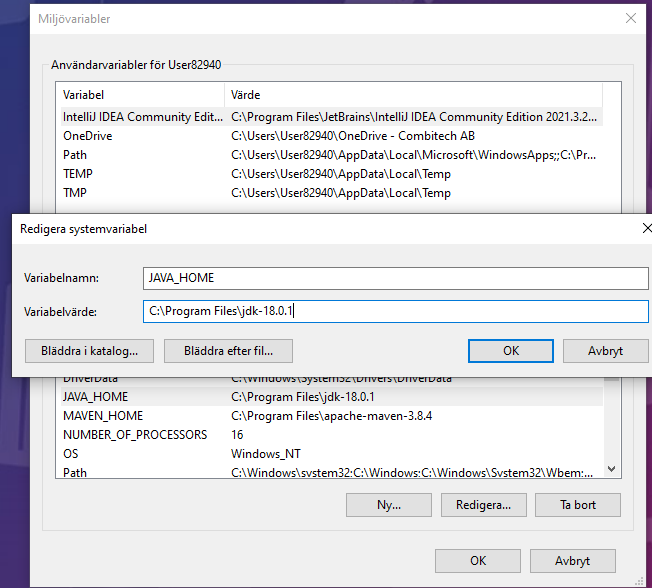
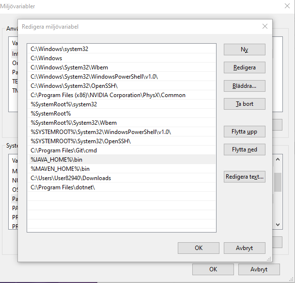
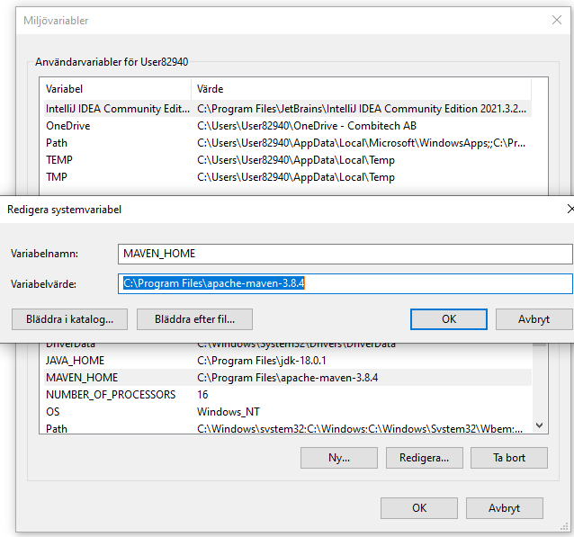
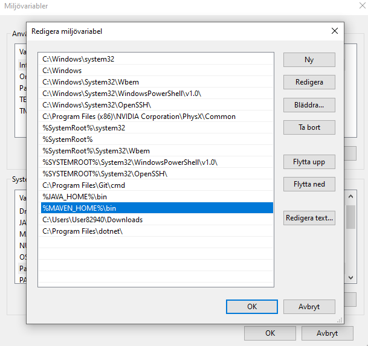

# java-course-day1

Kod från dag 1 i "Utveckling i modern Java"


#### Tider:   
8.30-16.30 med en timmes lunch. Dagen delas upp efter kursdeltagarnas önskemål.
  

## Kursmaterial
Kursmaterialet för denna dagen består av detta git-repo


## Programvara
Vi kommer installera nödvändig programvara tillsammans under kursens gång. Däremot kan det vara bra att ha laddat 
ned en IDE innan kursstart.
   
Länk till nedladdning: https://www.jetbrains.com/idea/download/#section=windows 

Det är såklart helt okej att använda någon annan IDE. T.ex Eclipse, VSCode, NetBeans

## Java

https://dev.java/ - bra samlingssida för allt rörande Java

https://jdk.java.net/18/ - ladda ned JDK.

### Installera Java 
- Ladda ned JDK från länk ovan
- På Windows lägg till en systemvariabel JAVA_HOME som pekar på där du unzippat JDK:en   
  

- Välj därefter den systemvariabeln som heter Path och tryck redigera och lägg där till ```%JAVA_HOME%\bin```  
  
- Öppna nu ett terminalfönster och skriv ```java -version``` . Om allt gått bra bör man få tillbaka vilken java-version det är.


### javac
För att kompilera ett Java-program från en terminal så används ``javac``. 

- Om vi har ett litet program som ser ut som    
```java
  public class MyFirstClass {
      //i intelliJ, skriv "psvm" och tryck enter för att få en main-metod
      public static void main(String[] args) {
      //"sout" och enter ger System.out.println()
      //args är argument in till programmet, args[0] är det första argumentet
          System.out.println("Hello World " + args[0]);
  }
  }

```
- som ligger i en fil MyFirstClass.java så kompilerar vi det genom att köra   
 ```javac MyFirstClass.java```
- Därefter kan vi köra programmet genom att köra    
- ```java MyFirstClass firstArg```   
- och vi får då output ``Hello World firstArg```från programmet.

### Andra command-line tools som kommer med JDK:en   
- `jconsole` för att ansluta till ett java-program och få en grafisk överblick över minnesanvändning, antal trådar, CPU-användning etc 
- `jshell` en REPL för Java.
- och ett antal fler

### Maven
Maven är ett byggverktyg för Java. Använder en XML-baserad konfigurationsmodell i en speciell fil som heter pom.xml (pom = Project Object Model)

För att installera Maven ladda ned från https://maven.apache.org/download.cgi

- På Windows lägg till en systemvariabel MAVEN_HOME som pekar på där du unzippat nedladdningen   
    
- Välj därefter den systemvariabeln som heter Path och tryck redigera och lägg där till ```%MAVEN_HOME%\bin```
  


- För att skapa ett Maven-projekt i IntelliJ ```File>New>Project>Välj Maven i högerspalten>next```
- Fyll i name, location och groupid.

Via terminalen kan man köra    

```
mvn archetype:generate \
-DgroupId=com.combitech \
-DartifactId=java-day-1 \
-DarchetypeVersion=1.4 \
-DinteractiveMode=false
```

För att lägga till ett dependency och använda något som inte är inkluderat i JDK:en så lägger man det i pom.xml under `` dependencies``

    <dependencies>
        <dependency>
            <groupId>org.junit.jupiter</groupId>
            <artifactId>junit-jupiter-params</artifactId>
            <version>5.8.1</version>
        </dependency>
        <dependency>
            <groupId>org.apache.logging.log4j</groupId>
            <artifactId>log4j-api</artifactId>
            <version>2.6.1</version>
        </dependency>
        <dependency>
            <groupId>org.apache.logging.log4j</groupId>
            <artifactId>log4j-core</artifactId>
            <version>2.6.1</version>
        </dependency>
    </dependencies>


För att veta vilket groupId, artifactId och version man kan ange kan man söka efter biblioteket man vill lägga till på:
https://mvnrepository.com/

### Grunder

- ####Variabler 
    Det finns fyra "typer" av variabler i Java    

    - Instansvariabler (icke-statiska variabler). Dessa lagrar state för en instans av en klass, dvs har unika värden för varje objekt. De är deklarerade utan `static` keyword.

    - Klassvariabler. En klassvariabel är deklarerad med `static` keyword; detta betyder att det endast finns en kopia av denna variabeln som delas mellan alla objekt av klassen. Exempelvis  
   en klass som representerar en hund skulle kunna ha en variabel som är `static` för antal ben. Då alla hundar har fyra ben och således skulle variabeln defineras som `static int numLegs = 4;`
    - Lokala variabler. Dessa är variabler som är deklarerade inne i metoder. På samma sätt som ett objekt sparar sitt state i en instansvariabel så använder metoder lokala variabler för att 
   spara temporärt state. Det finns ingen speciell syntax för att deklarera en lokal variabel utan att den är lokal avgörs från var den är deklarerad.


  ```java
  public class MyFirstClass {
    //i intelliJ, skriv "psvm" och tryck enter för att få en main-metod
    public static void main(String[] args) {
    //"sout" och enter ger System.out.println()
    //args är argument in till programmet, args[0] är det första argumentet
        System.out.println("Hello World " + args[0]);
  }
  }

  ```

- asda


